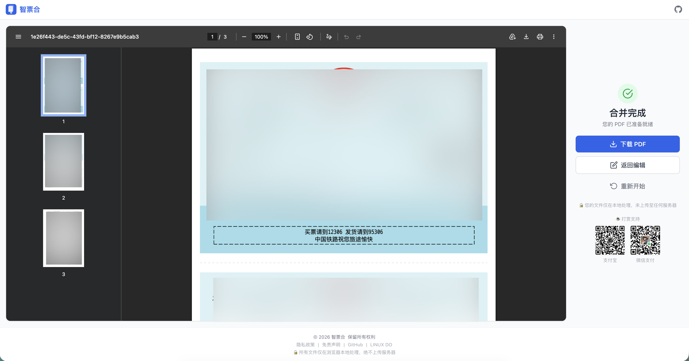

# 开源 | 智票合（Smart Ticket）— 出差报销逼出来的纯前端发票合并工具，零服务器零成本

## 🎯 出差人的痛，谁懂？

每次出差回来，最头疼的不是写报告，而是**打印报销发票**。

财务要求统一 A4 纸张、排版整齐，电子发票大小不一，有的是 PDF，有的是图片，手动一张张调整简直要命。打开 WPS —— 会员功能；试了几个在线工具 —— 要么收费，要么得上传文件到不知道哪个服务器。
 
作为一个技术人，我忍不了。

## 💡 从 OpenClaw Skill 到独立产品

最早的解决方案其实是在 OpenClaw 爆火的时候，基于它做了个 Skill，底层跑的 Python 脚本，能把发票图片合并成 A4 PDF。用着还行，但有个问题 —— 每次调用都要消耗 token，长期用下来成本不低。

后来 vibe coding 的风越吹越大，很多优秀的产品都是从一个小 idea 开始的。我就想：这个需求足够明确，为什么不把它做成一个**真正的在线产品**？

于是，**智票合（Smart Ticket）** 诞生了。

## 📸 产品长什么样？

### 首页

简洁的上传界面，支持拖拽上传，支持 PDF 和常见图片格式。

### 编辑页

上传后进入编辑模式：
- **智能排版**：发票默认 2 张/页，账单 4 张/页，也支持混排
- **图像增强**：对比度、亮度、锐化调节 + AI 边缘检测校正（基于 Scanic WASM）
- **自由操作**：拖拽排序、旋转、删除，所见即所得

### 结果页

一键合并，生成标准 A4 PDF，直接下载打印。

## 🔧 技术栈 & 架构决策

作为技术社区，聊聊选型：

| 技术 | 选择 | 理由 |
|------|------|------|
| 框架 | React 19 + TypeScript | 类型安全，生态成熟 |
| 构建 | Vite 8 | 快，真的快 |
| 样式 | UnoCSS | 原子化 CSS，打包体积小 |
| PDF 生成 | pdf-lib | 纯 JS 操作 PDF，无服务端依赖 |
| PDF 渲染 | pdfjs-dist | Mozilla 出品，CJK 字体支持好 |
| 图像处理 | Canvas API + Scanic (WASM) | 边缘检测校正，浏览器端高性能计算 |
| 状态管理 | Zustand | 轻量、简洁、够用 |
| 拖拽排序 | @dnd-kit | 现代化拖拽方案，无障碍支持 |
| 部署 | GitHub Pages | 零成本，gh-pages 一键部署 |

**核心设计原则：纯前端，零服务器。**

所有文件处理都在浏览器本地完成，不经过任何服务器。你的发票数据完全留在你的设备上，隐私安全有保障。

当前阶段为了节约成本，采用 GitHub Pages 免费部署，零运维、零费用。

## 🗺️ 未来规划

- [ ] 批量模板（自定义每页行列数）
- [ ] OCR 识别发票金额并自动汇总
- [ ] 更多图像增强算法
- [ ] PWA 离线支持
- [ ] i18n 多语言

## 🙏 求 Star / 求反馈

如果你也被报销发票折磨过，不妨试试：

- 🌐 **在线体验**：[https://cdk1025.github.io/smart_ticket/](https://cdk1025.github.io/smart_ticket/)
- 📦 **GitHub 仓库**：[https://github.com/cdk1025/smart_ticket](https://github.com/cdk1025/smart_ticket)

项目完全开源（MIT），欢迎 ⭐ Star、🍴 Fork、提 Issue 和 PR！

有任何建议或者 Bug 反馈，欢迎在评论区或 GitHub Issues 里聊～
